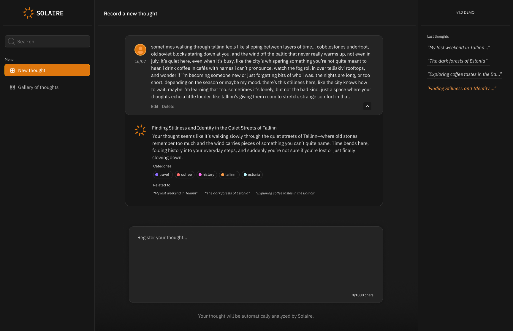
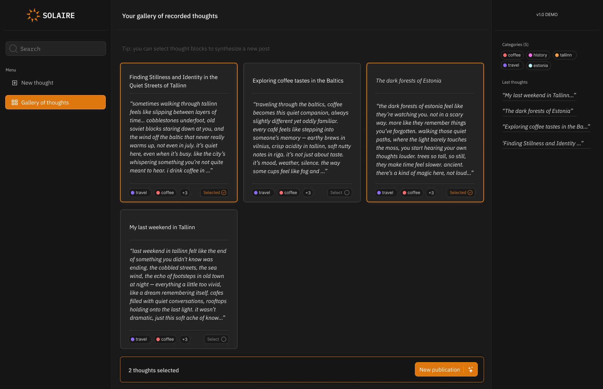
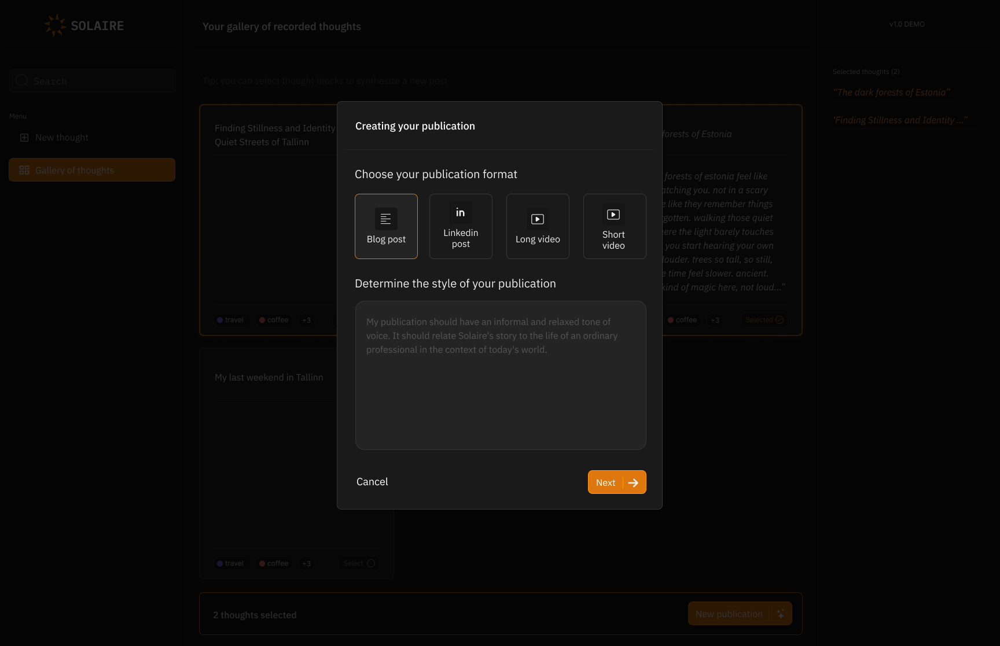
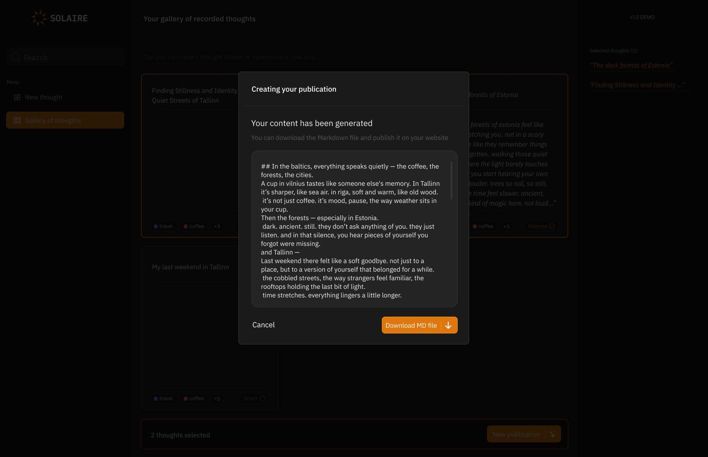

# 🌞 Solaire

**Daily writing meets AI interpretation — for clarity, consistency, and creativity.**

> 📦 **Work in Progress**:
Solaire is under active development — the user interface is currently being implemented, with ongoing refinements to the backend architecture to improve modularity, testability, and performance.

## ✨ Why "daily writing"?

> **"Most people lose touch with themselves because they forget what drives them."**

### 🧠 1. **Life gets noisy.**

- People are bombarded daily by **external demands**: work, social media, responsibilities, deadlines.
- In this noise, **self-reflection takes a back seat.**
- Without intentional time to check in, people start running on autopilot — reacting instead of acting with purpose.

### 🔄 2. **We fall into loops of obligation.**

- We begin to **prioritize what others expect** over what we truly want.
- That leads to goals that are performative, not authentic — which slowly disconnects us from our own "why".

### 🕳️ 3. **Emotions and motivations are fleeting unless captured.**

- That burst of inspiration from a walk or a conversation? It fades.
- Without writing or reflecting, **you don’t encode it into memory** — and the insight is lost.
- Over time, your **inner compass stops pointing anywhere at all.**

### ✍️ That's why daily writing is powerful:

It **externalizes your internal world.**
It reminds you:
💡 _"This is what matters to me."_
🔥 _"This is what gives me energy."_
🧭 _"This is where I want to go."_

Even if the entries are messy or short, that habit **saves pieces of you** — so you don’t lose track.

That one sentence carries all of this. It’s not just poetic — it’s grounded in real behavior, neuroscience, and lived experience.

Most people lose touch with themselves because they forget what drives them. Daily writing is a powerful tool for reconnection, but it requires discipline — and often, we don’t even know where to start.

Also, for those who work with content, maintaining a constant presence on social media can feel exhausting. Spending hours writing something cohesive can feel like a waste when there’s so much else to do.

**Solaire was created to solve these two problems:**

- To create a personal, informal, and judgment-free space for recording daily thoughts (your "handmade chunks");
- To turn these fragments into useful, well-structured, and publishable content — with the help of AI.

## 💡 What Solaire Does

- ✍️ **Free-form daily writing**, limited to 1000 characters per entry.
- 🧠 **Automatic analysis of your thoughts** with an AI called `ThoughtInterpreterAgent`.
- 🏷️ **Categorization and detection of recurring or emerging topics.**
- 🗂️ **Organizes your thoughts by tags, dates, and semantic clusters.**
- 📤 **Automatically generates content** (Instagram post, blog post, video, etc.) based on your thoughts.
- 🧩 **Offline LLM's integration** (privacy focused).

## 🎨 User Interface

The UI is designed to be minimal, welcoming, and functional. It's divided into three main sections:

1. **History page**

   - See your past thoughts
   - Write a new one

2. **Gallery**
   - See and search for your thoughts in a gallery view
   - Select multiple
   - Generate a blog or social media publication

| Screenshots |
|-------------|
|  |
|  |
|  |
|  |
|  |

🧪 The frontend is built with:

- React + TypeScript
- TailwindCSS
- Tanstack
- Vite

### 🧠 Backend Design

The backend is built with **Python** and adheres some principles inspired by **DDD**. It follows a layered architecture, structured as:

- **Domain layer** – Pure business logic and core entities
- **Application layer** – Orchestrates use cases and coordinates services
- **Infrastructure layer** – Handles integrations, databases, and frameworks

Key characteristics:

- ✅ **Custom Dependency Injection** system to manage object lifecycles and decouple implementations.
- ✅ **Vendor-agnostic ORM layer**, abstracted to allow database flexibility and reduce vendor lock-in.
- ✅ **Modular and scalable**, designed for clear boundaries between logic, persistence, and services.

This setup not only supports clean code and testability, but also lays the groundwork for evolving the app into a distributed or service-oriented architecture later, if needed.

#### Test Coverage

Solaire is built with robustness in mind. We're implementing a comprehensive testing strategy across multiple layers of the system:

**Unit Tests**

- Focused on business logic and domain models
- Validate use cases in isolation

**Repository Tests**

- Cover interactions with relational databases
- Follow the repository pattern to ensure correct persistence behavior
- Designed to run against test databases for realistic integration

**Vector Database Tests**

- Verify embedding insertion, similarity search, and semantic clustering logic
- Ensure Weaviate integration works correctly under different chunking scenarios

**LLM Interaction Tests**

- Test prompt engineering and the behavior of the ThoughtInterpreterAgent
- Include validation for parsing, topic extraction, and hallucination mitigation
