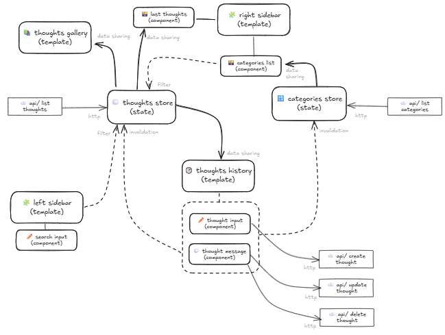

# Frontend

## Frontend Architecture Overview

This diagram illustrates the system architecture for the frontend application, showcasing a well-structured state management pattern with clear separation of concerns between data stores, UI components, and API interactions.

### Core Architecture Components

The frontend follows a centralized state management pattern with two main data domains:

#### **Thoughts Store (State Management)**
- **Purpose**: Central state management for thoughts data
- **Data Flow**: 
  - Receives data via HTTP from `/api/list thoughts` endpoint
  - Distributes data to UI templates through data sharing
  - Handles filtering from search input components
  - Receives invalidation signals to trigger data refresh

#### **Categories Store (State Management)**
- **Purpose**: Central state management for categories data
- **Data Flow**:
  - Receives data via HTTP from `/api/list categories` endpoint
  - Provides data to categories list component
  - Receives invalidation signals for data consistency

### UI Templates and Components

#### **Main Templates**
- **Thoughts Gallery Template**: Displays collections of thoughts using data from the thoughts store
- **Thoughts History Template**: Shows chronological lists of thoughts with individual thought components
- **Left Sidebar Template**: Contains search functionality for filtering thoughts
- **Right Sidebar Template**: Displays categories and last thoughts

#### **Interactive Components**
- **Search Input Component**: Provides filtering capabilities to the thoughts store
- **Thought Message Component**: Displays individual thoughts,. Updates, and deletion with API interactions
- **Thought Input Component**: Handles thought creation. 
- **Categories List**: Show all categories and filter thoughts by category.

### API Integration

The frontend integrates with several backend endpoints:

- **`GET /thoughts`**: Retrieves thoughts data for the thoughts store
- **`GET /categories`**: Retrieves categories data for the categories store
- **`POST /thoughts`**: Creates new thoughts via the thought input component
- **`PATCH /thoughts/<uuid>`**: Updates existing thoughts via the thought input component
- **`DELETE /thoughts/<uuid>`**: Deletes thoughts via the thought input component

Obs: check api reference at `http://localhost:8000/docs`

### Data Flow Patterns

#### **Solid Arrows**: Direct Data Flow
- Data sharing from stores to UI components
- HTTP requests to API endpoints

#### **Dashed Arrows**: Control Signals
- Filter commands for data selection
- Invalidation signals for triggering data refresh

### Architecture Benefits

This architecture provides several advantages:

1. **Single Source of Truth**: Centralized state management ensures data consistency
2. **Separation of Concerns**: Clear distinction between data management and UI rendering
3. **Reactive Updates**: Invalidation signals ensure UI updates when data changes
4. **Scalable Design**: Modular components can be easily extended or modified
5. **Efficient Data Flow**: Optimized data sharing reduces redundant API calls

The design follows modern frontend development patterns, likely implementing a Flux or Redux-like state management approach for robust and maintainable code.
